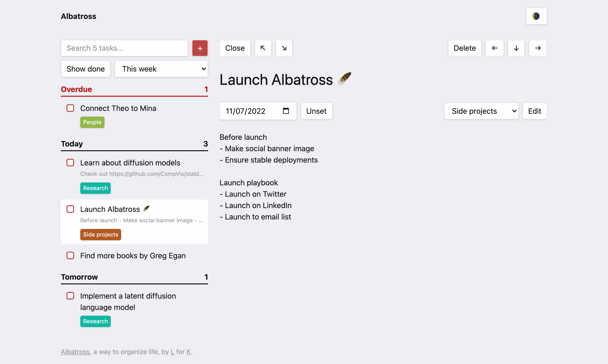

# Albatross 🪶

**Albatross** is a little to-do list app I made for myself and [Karina](https://karinanguyen.com/) to distract myself from [more important responsibilities](https://twitter.com/thesephist/status/1588795933096964096). It's designed mainly for myself, so it prioritizes simplicity, and fitting my own personal needs. However, if you really must try it, you can go see a [demo here](https://albatross.oaklang.org/).

Like many of my projects, Albatross is written in [Oak](https://oaklang.org/) and [Torus](https://github.com/thesephist/torus). Search is handled with [libsearch](https://github.com/thesephist/libsearch). Illustrations used in the empty states in the app were generated with DALL-E 2.

## Feature set

- Tasks that support categories, due dates, and an extra detail/comment field
- Fast as-you-type search with [libsearch](https://github.com/thesephist/libsearch)
- Light and dark themes
- Speed 🏃‍♂️

I've also considered adding some ✨AI features✨ because doing that seems very hype these days, but haven't gotten around to it yet. Here are some ideas I've thought about, though:

- Natural language "quick create" for tasks, e.g. being able to type in _Call Rob about improving deploy playbook @ next Tues_ and have it be parsed into the right shape
- Automatically "cleaning up" notes under a task, especially for tasks or notes that are sloppy records of conversations
- Custom encouragements whenever a task is completed, e.g. checking off "Get back to Theo via email" should elicit some encouragement message like "Great job sending that email!"
- A tool for breaking down larger tasks into smaller sub-tasks and making them more approachable

## Development

Like many of my projects, Albatross is built and managed with [Oak](https://oaklang.org/). There's a short [Makefile](Makefile) that wraps common `oak` commands:

- `make` runs the Flask web server, and is equivalent to `flask run`
- `make fmt` or `make f` auto-formats any tracked changes in the repository
- `make build` or `make b` builds the client JavaScript bundle from `src/app.js.oak`
- `make watch` or `make w` watches for file changes and runs the `make build` on any change

### Deployments

Albatross is a bit unique in that it's **designed to be deployable as both a server-backed full-stack web app, persisting data on the backend; and a client-only static single-page app, persisting to browser `localStorage`**. Both versions run very nearly the same code, except for the bits that concern syncing.

The static SPA is deployed via Vercel, with `./static/` as the "build output directory".

The full-stack app is defined by `albatross.service` and runs as a systemd service in a Linux box.
